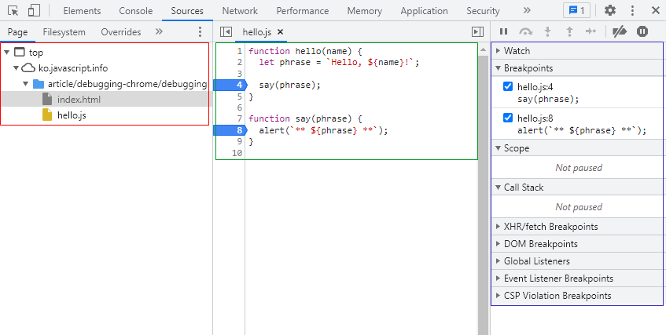
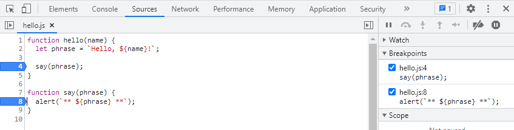
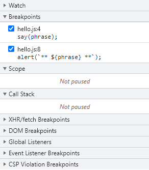

220302 자바스크립트 정리.

# ★★ Chrome으로 디버깅하기

### ★ 디버깅이란?
디버깅은 스크립트 내 에러를 검출해 제거하는 일련의 과정이다. 간단한 예시로 디버깅해보자.<br></br>



1. 빨간 영역은 파일 탐색 영역으로 페이지를 구성하는데 있어서 쓰인 리소스를 보여준다.
2. 초록 영역은 코드 에디터 영역으로 파일 탐색 영역에서 고른 리소스에 대한 코드를 보여준다.
3. 파란 영역은 자바스크립트 디버깅 영역으로 디버깅에 대한 기능을 제공한다.

### ★ 중단점이란?<br></br>
자바스크립트의 실행이 중단되는 코드 내 지점을 의미한다. 이를 사용하는 이유는 중단점을 사용하면 실행이 중지된 지점까지 어떤 변수가 담겨있는지 확인할 수 있다. 두 가지로 확인할 수 있다.<br></br>



코드 에디터 영역에서 4, 8이라고 써있는 부분을 클릭하면 중단점이 활성화된다. 우측 자바스크립트 디버깅 영역의 breakpoints가 중단점을 확인할 수 있는 영역이다.<br></br>
코드 내에서도 디버깅을 확인할 수 있다. 내가 중단점을 확인할 수 있는 곳에 debugger; 라고 작성하면 된다.<br></br>

### ★ 자바스크립트 영역
자바스크립트 영역을 더 확인해보자.



1. Watch - 내가 원하는 표현식을 찾아볼 수 있다.
2. Breakpoints - 중단점을 의미한다.
3. Scope - 현재 정의된 변수가 무엇인지 보여준다. 위 이미지에서는 name, phrase일 것이다. 참고로 name의 변수에는 John 값이 들어가있는데 이는 HTML 부분에서 파라미터로 John을 입력한다.

<hr/>

# ★★ 주석

### ★ 좋은 주석이란?
그동안 내가 다른 사람들과 협업하면서 주석을 작성했을 때는 대개 설명이 많이 들어간 소스코드였다. 하지만 이는 좋은 소스가 아니다. 좋은 소스라 하는 것은 코드를 읽기 전에 대강 어떤 소스코드인지 읽혀야 한다. 참고할 자료에는 UML, JSDoc이 있으므로 시간이 나면 보자.<br></br>

<hr/>

# ★★ 테스트 자동화와 Mocha

### ★ 테스트 자동화란?
테스트 자동화라는 것은 부트캠프에서의 Django Ninja API를 공부할 때 잠시 보았었다. 아직은 잘 모르지만 왜 테스트 자동화가 필요한지에 대해 생각해보았다. 생각해보면 개발은 만들어냈다고 해서 끝이 아닌 꾸준히 유지보수도 해야하고 테스트해야 고객들에게 서비스를 제공할 수 있기 때문에 테스트는 필요하다. 테스트에 있어서 수동으로 하면 휴먼 에러가 반드시 발생하기 때문에 자동화를 구축하는 것이다. BDD라고 하는 방법론이 있는데 따로 또 읽어보면서 공부해야겠다.<br></br>

### ★ 테스트 자동화를 예시로 알아보자.
x를 n번 곱해주는 함수를 구현한다고 가정한다. 참고로 자바스크립트에서는 **의 연산자로 거듭제곱을 포현할 수 있지만 직접 함수를 구현하면서 BDD를 이해해보자. 참고로 함수 이름은 pow이다.<br></br>

```
describe("pow", function() {
    it("주어진 숫자의 n 제곱", function() {
        assert.equal(pow(2, 3), 8);
    });
});
```
1. describe("함수의 이름", function()) { ... }) - describe의 첫번째 인수에서는 함수의 이름을 넣는다. 여기에서 나는 pow로 지정했다.
2. it("유스케이스 설명", function() {...}) - it의 첫번째 인수는 유스케이스에 대한 설명을 넣는다. 이 예시로 따지자면, 숫자의 제곱이라고 자연어로 적으면 될 것이다.
3. assert.equal(value1, value2) - 대강 assert.equal은 value1과 value2를 비교했을 때 다르다고 판단되면 에러를 반환해준다. 위의 코드를 보면 내가 지정한 pow 함수에 2, 3이라는 파라미터를 넣고 8과 같은지 비교하는 것으로 이해하면 될 것 같다.

