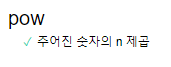

220302 자바스크립트 정리.

# ★★ Chrome으로 디버깅하기

### ★ 디버깅이란?
디버깅은 스크립트 내 에러를 검출해 제거하는 일련의 과정이다. 간단한 예시로 디버깅해보자.<br></br>


1. 빨간 영역은 파일 탐색 영역으로 페이지를 구성하는데 있어서 쓰인 리소스를 보여준다.
2. 초록 영역은 코드 에디터 영역으로 파일 탐색 영역에서 고른 리소스에 대한 코드를 보여준다.
3. 파란 영역은 자바스크립트 디버깅 영역으로 디버깅에 대한 기능을 제공한다.

### ★ 중단점이란?<br></br>
자바스크립트의 실행이 중단되는 코드 내 지점을 의미한다. 이를 사용하는 이유는 중단점을 사용하면 실행이 중지된 지점까지 어떤 변수가 담겨있는지 확인할 수 있다. 두 가지로 확인할 수 있다.<br></br>


코드 에디터 영역에서 4, 8이라고 써있는 부분을 클릭하면 중단점이 활성화된다. 우측 자바스크립트 디버깅 영역의 breakpoints가 중단점을 확인할 수 있는 영역이다.<br></br>
코드 내에서도 디버깅을 확인할 수 있다. 내가 중단점을 확인할 수 있는 곳에 debugger; 라고 작성하면 된다.<br></br>

### ★ 자바스크립트 영역
자바스크립트 영역을 더 확인해보자.


1. Watch - 내가 원하는 표현식을 찾아볼 수 있다.
2. Breakpoints - 중단점을 의미한다.
3. Scope - 현재 정의된 변수가 무엇인지 보여준다. 위 이미지에서는 name, phrase일 것이다. 참고로 name의 변수에는 John 값이 들어가있는데 이는 HTML 부분에서 파라미터로 John을 입력한다.

<hr/>

# ★★ 주석

### ★ 좋은 주석이란?
그동안 내가 다른 사람들과 협업하면서 주석을 작성했을 때는 대개 설명이 많이 들어간 소스코드였다. 하지만 이는 좋은 소스가 아니다. 좋은 소스라 하는 것은 코드를 읽기 전에 대강 어떤 소스코드인지 읽혀야 한다. 참고할 자료에는 UML, JSDoc이 있으므로 시간이 나면 보자.<br></br>

<hr/>

# ★★ 테스트 자동화와 Mocha

### ★ 테스트 자동화란?
테스트 자동화라는 것은 부트캠프에서의 Django Ninja API를 공부할 때 잠시 보았었다. 아직은 잘 모르지만 왜 테스트 자동화가 필요한지에 대해 생각해보았다. 생각해보면 개발은 만들어냈다고 해서 끝이 아닌 꾸준히 유지보수도 해야하고 테스트해야 고객들에게 서비스를 제공할 수 있기 때문에 테스트는 필요하다. 테스트에 있어서 수동으로 하면 휴먼 에러가 반드시 발생하기 때문에 자동화를 구축하는 것이다. BDD라고 하는 방법론이 있는데 따로 또 읽어보면서 공부해야겠다.<br></br>

### ★ 테스트 자동화를 예시로 알아보자.
x를 n번 곱해주는 함수를 구현한다고 가정한다. 참고로 자바스크립트에서는 **의 연산자로 거듭제곱을 포현할 수 있지만 직접 함수를 구현하면서 BDD를 이해해보자. 참고로 함수 이름은 pow이다.<br></br>

```
describe("pow", function() {
    it("주어진 숫자의 n 제곱", function() {
        assert.equal(pow(2, 3), 8);
    });
});
```
1. describe("함수의 이름", function()) { ... }) - describe의 첫번째 인수에서는 함수의 이름을 넣는다. 여기에서 나는 pow로 지정했다.
2. it("유스케이스 설명", function() {...}) - it의 첫번째 인수는 유스케이스에 대한 설명을 넣는다. 이 예시로 따지자면, 숫자의 제곱이라고 자연어로 적으면 될 것이다.
3. assert.equal(value1, value2) - 대강 assert.equal은 value1과 value2를 비교했을 때 다르다고 판단되면 에러를 반환해준다. 위의 코드를 보면 내가 지정한 pow 함수에 2, 3이라는 파라미터를 넣고 8과 같은지 비교하는 것으로 이해하면 될 것 같다.

### ★ 테스트 자동화 라이브러리
테스트 자동화를 위한 라이브러리 3종류를 알아보자.

1. Mocha - 위에서 사용했던 모듈인 describe와 it과 같은 모듈을 제공한다.
2. Chai - 다양한 assertion을 제공해주는 라이브러리이다. 위의 예시에서는 assert.equal 정도만 사용한다.
3. Sinon - 함수의 정보를 캐내는 데 사용되는 라이브러리라고 한다. 현재 예시에서는 사용하지 않는다.

### ★ 테스트 자동화를 해보자.
index.html을 통해서 테스트 자동화를 해보겠다. 예시는 index.html에 적겠다.<br></br>

```
<link rel="stylesheet" href="https://cdnjs.cloudflare.com/ajax/libs/mocha/3.2.0/mocha.css">
<script src="https://cdnjs.cloudflare.com/ajax/libs/mocha/3.2.0/mocha.js"></script>
<script>
    mocha.setup('bdd');
</script>
<script src="https://cdnjs.cloudflare.com/ajax/libs/chai/3.5.0/chai.js"></script>
<script>
    let assert = chai.assert;
</script>
```
HTML의 헤더에서는 이렇게 작성한다. 대부분 큰 의미는 없으나 정리해보자면 아래와 같다. <br></br>

1. mocha의 css
2. mocha 라이브러리 선언
3. mocha 기본 셋팅
4. chai 라이브러리 선언
5. 현재 프로젝트에서 chai의 assert를 사용할 것이기 때문에 전역변수로 assert라는 변수에 저장한다.

헤더 작성을 완료했다면 바디 부분에 다음과 같이 적는다.<br></br>

```
<script>
    function pow(x, n) {

    }
</script>

<script src="../js/test.js"></script>

<div id="mocha"></div>

<script>
    mocha.run();
</script>
```

1. 거듭제곱을 사용할 함수이다. (테스트 하는 목적이 아닌 순수한 HTML에서 사용하는 함수라고 생각하면 될 것 같다.)
2. test.js를 불러온다. 참고로 이 곳에는 내가 처음에 작성했던 라이브러리를 통해 작성한 코드이다.
3. 테스트를 실행한다.


실행 결과는 다음과 같다. 에러가 발생하는 것이 당연하다. 그 이유는 우리는 위에서 pow 내부 함수를 작성하지 않았기 때문이다.<br></br>

```
function pow(x, n) {
    return 8;
}
```

일단 눈속임으로 8을 리턴시켜서 mocha가 무조건 정답으로 이해해버리게 만든다.<br></br>



이렇게 테스트를 통과한 것을 알 수 있다. 하지만 이 부분은 불안정하다. 다른 소스코드를 추가해보자.<br></br>

```
describe("pow", function() {
    it("주어진 숫자의 제곱", function() {
        assert.equal(pow(2, 3), 8);
        assert.equal(pow(3, 4), 81);
    });
})
```

이런 식으로 assert.equal문을 하나 더 추가할 것이다. 하지만 이 방법은 별로인게 위쪽 코드에서 오류가 나면 아래 코드의 오류를 확인할 수 없다. 따라서 it 구문을 따로 작성해준다. 참고로 작성해주는 김에 유스케이스 이름도 변경해주겠다.<br></br>

```
describe("pow", function() {
    it("2의 3제곱은 8이다.", function() {
        assert.equal(pow(2, 3), 8);
    });
    it("3의 4제곱은 81이다.", function() {
        assert.equal(pow(3, 4), 81);
    });
});
```

결과를 확인해보자.<br></br>


index.html의 스크립트에서 항상 return 값이 8을 반환해주기 때문에 다음과 같은 결과물을 얻게 되는 것이다. 이제 pow 함수 구문을 작성해서 우리가 원하는 값을 얻어보자. 일단 로직을 좀 생각해봐야 한다.<br></br>

```
function pow(x, n) {
    let result = 1;
    
    for(i=0; i<n; i++) {
        result *= x;
    }
    return result;
}
```

1. pow(x, n)의 의미는 x의 n제곱이라는 의미이다. 
2. result를 1로 초기화하는 이유는 result 값이 0이 되면 계속 0을 곱해주기 때문에 강제적 0 리턴이 된다.
3. 처음에는 사실 이 로직이 생각이 안났다. (작성하고 있는 지금 이 시간이 밤을 새서 그런지 생각안났음) 그래서 곰곰히 생각해보니 n보다 작은 수만큼 반복해서 x를 곱해줘야 하는 것이 보였다. pow(2, 3)으로 예시를 들며 보았을 때, i<3이기 때문에 0, 1, 2해서 3번 x의 값을 곱한다. 따라서 x는 2이므로 1 * 2(첫번째) * 2(두번째) * 2(세번째) 로 8이 된다. 
4. 그리고 함수의 밖에서 사용하기 위해 result 값을 리턴시킨다.

이제 test.js에서의 describe 부분을 수정하겠다.

```
describe("pow", function() {
    function makeTest(x) {
        let expected = x*x*x;
        it("`${x}를 3번 곱하면 ${expected}입니다.`, function() {
            assert.equal(pow(x, 3), expected);
        });
    }
    for(let x=0; x<=5; x++) {
        makeTest(x);
    }
})
```

1. makeTest 함수를 만든다.
2. x를 파라미터로 받기 때문에 expected라는 변수에 x를 3번 곱한 값을 저장하도록 한다. 이러면 무조건 3제곱으로 나타나게 될 것이다.
3. 파라미터가 2일 경우, 2를 3번 곱한 값이 expected에 8로 저장되기 때문에 이를 표현하기 위해 ${}를 사용해서 표현한다.
4. 0부터 5까지의 숫자를 for구문으로 값을 얻어 makeTest 함수의 파라미터로 들어가도록 한다.


그럼 다음과 같이 각 5까지의 3제곱이 잘 리턴되어 체크된 것을 확인할 수 있다.<br></br>