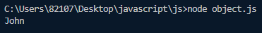
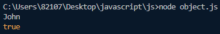
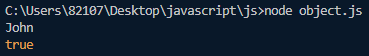

220408 자바스크립트 정리.

# ★★ 객체: 기본

### ★ 객체형이란 무엇일까?
자료형은 하나의 데이터만 담는 그릇이라면 객체형은 여러 가지 형태로 데이터를 보낼 수 있다. 파이썬으로는 딕셔너리의 형태라고 생각하면 될 것 같다.

```
let user = {
    name: "John",
    age: 30,
}
```
이런 식으로 작성하는 것이라는데 Ajax에서 한 번 본 기억이 있다. 프론트에서 백으로 API 요청을 할 때 이러한 json 형식으로 보냈었는데 이것이 객체형이라고 생각하면 될 것 같다. 파이썬에서도 .을 통해서 해당하는 value 값을 가져왔는데 이 또한 같은 것 같다. user.name을 하면 "John"이 출력될 것이다.



하지만 되지 않는 경우도 있다. likes birds라는 key 값이 있다고 하면 user.like birds라고 적게 되는데 이는 에러를 발생시킨다. 여러 단어로 만든 프로퍼티 값은 점 표기법이 아닌 대괄호 표기법을 사용해야 한다. 

```
let test = {};
user["the test"] = true;

console.log(user["the test"]);
```

이를 실행시키면 다음과 같다.



조금 더 실무적인 것을 확인해보자. 실제로 프로젝트를 진행할 때 프로퍼티 값을 변수에서 가져와 그대로 사용한다.

```
function makeUser(name, age) {
    return {
        name: name,
        age: age,
    }
}
```

자료형에서 변수명에 예약어를 사용하면 되지 않는다고 했다. 그런데 프로퍼티 이름에는 딱히 제약이 없다. 물론 <strong>__proto__</strong> 라고 하는 것은 제약이 있다. 이는 후반부에 다룬다고 하니 일단 넘어가자.

### ★ in으로 프로퍼티 존재 확인
파이썬에서도 for num in numbers: 이런 식으로 존재 여부를 확인하는데 자바스크립트로 마찬가지다. 

```
let user = {
    name: "John",
    age: 30,
}

console.log(user.name);
console.log("age" in user)
```


이렇게 결과가 나오는 것을 확인할 수 있다.

### ★ 참조에 의한 객체 복사
간단히 정리하면 한 원시 자료형에 값을 넣고 이를 다른 변수로 다시 값을 넣으면 원시값이 다른 변수에 저장된다.

```
let test1 = "Hello!"
let test2 = test1
```
이렇게하면 test1, test2 변수에 "Hello!" 가 들어가있음을 확인할 수 있다. 이를 원시형이 아닌 객체형으로 해도 같은 값을 얻는다.

```
let test1 = {name: "csd"};
let test2 = test1;
test2.name = 'sd';
console.log(test1)
```
이렇게 test2의 프로퍼티 값을 변경하면 test1의 객체 자료도 변경됨을 확인할 수 있다. 이처럼 test2가 test1에 참조되기 때문에 test2의 값을 변경해도 test1의 객체가 변경되는 것이다.

### ★ 가비지 컬렉션
자바스크립트는 항상 메모리 처리를 한다. 우리가 생성한 변수, 함수 등등 모두 메모리를 차지하게 되는데 쓸모 없어지게 된 메모리는 어떻게 처리할까? 바로 이 가비지 컬렉션을 사용해 처리한다.

```
let user = {
    name: "csd",
};
```
라고 해보자. 그러면 현재 이 user라는 변수는 전역변수이다. user가 name이라는 객체를 가지고 있는 것이다. 이제 이것을 null이라고 지정해 도달할 수 없는 상태로 만들어보겠다.

```
user = null;
```
이러면 name의 프로퍼티가 null이 되면서 더 이상 도달할 수 없는 상태가 되어버린다. 위에서 했던 참조를 했을 경우에는 전역 변수의 값을 null로 만들더라도 객체에는 접근할 수 있기 때문에 메모리에서 삭제되지 않는다.